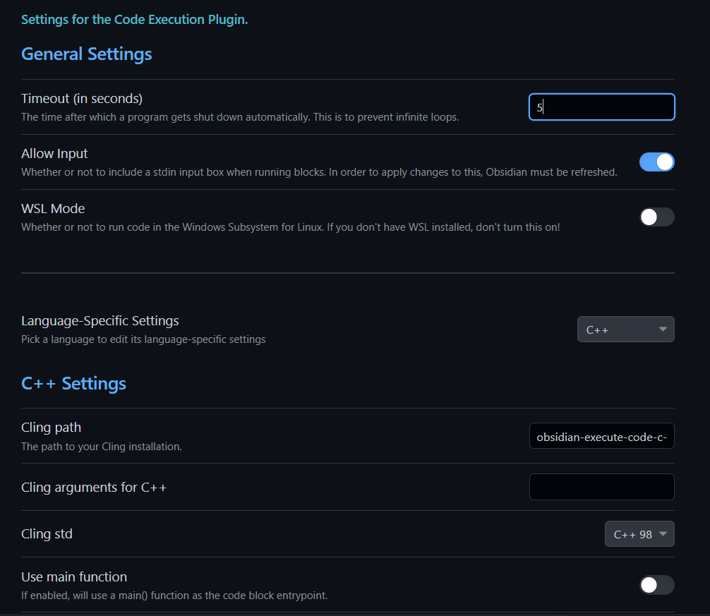

## [obsidian-execute-code](https://github.com/twibiral/obsidian-execute-code) c/c++ openmp support

Use gcc/clang instead of cling in [obsidian-execute-code](https://github.com/twibiral/obsidian-execute-code)

## Require

* c/c++ compiler
* close options `wsl model `and `use main func`




## Install

1. download from [github releases](https://github.com/KM911/obsidian-cpp-openmp/releases)
2. go install

```bash
cd ./obsidian-cpp-openmp
go build .
```
